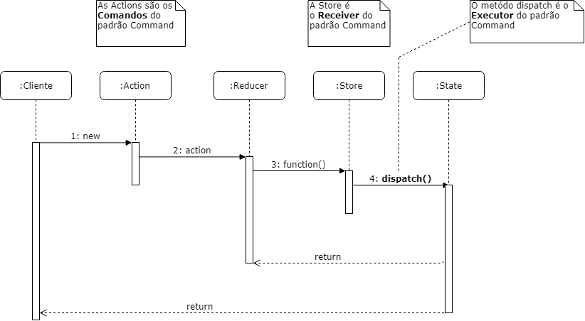

# React Native

| **Data**   | **Versão** | **Descrição**               | **Autor(es)**  |
| ---------- | ---------- | --------------------------- | -------------- |
| 14/04/2019 | 0.1        | Criação do Documento documentando Redux | Djorkaeff Alexandre |
| 26/05/2019 | 0.2        | Adição da introdução e Factory Method no React Native | Guilherme Siqueira |
| 26/05/2019 | 0.3        | Adição da introdução e Command Pattern no React Native | Guilherme Siqueira, Gustavo Braz, Djorkaeff Alexandre, Ícaro de Oliveira, Augusto Vilarins e Ana Carolina |
| 26/05/2019 | 0.4        | Adição do diagrama de sequência | Gustavo Braz, Guilherme Siqueira |
| 01/07/2019 | 0.5        | Unificação dos documentos | Guilherme Siqueira |

## Redux

* O Redux é um framework JavaScript
  * Funciona como um container de estados.
  * O Redux é basicamente divido em 3 partes: store, reducers e actions.
  * Segue 3 conceitos
    * Single Source of Truth (SSOT): Armazena todos os estados da aplicação em uma única fonte de informação.
    * State is Read-Only: Só é possível alterar um estado e emitindo uma action que contenha um objeto descrevendo o que ocorreu.
    * Changes are Made With Pure Funcions: As mudanças são feitas nos reducers, mostram como o estado atual levará ao estado seguinte.

### A store
<p align="justify">"store" é o nome dado pelo Facebook para o conjunto de estados da sua aplicação. Vamos pensar na store como um grande centro de informações, que possui disponibilidade para receber e entregar exatamente o que o seu componente requisita (seja uma função, ou uma informação propriamente dita). Tecnicamente, a store é um objeto JavaScript que possui todos os estados dos seus componentes.</p>

### Os reducers
<p align="justify">Cada dado da store deve ter o seu próprio reducer, por exemplo: o dado "user" teria o seu reducer, chamado "userReducer". Um reducer é encarregado de lidar com todas as ações, como algum componente pedindo para alterar algum dado da store.</p>

### As actions
<p align="justify">Actions são responsáveis por requisitar algo para um reducer. Elas devem ser sempre funções puras, o que, dizendo de uma forma leiga, quer dizer que elas devem APENAS enviar os dados ao reducer, nada além disso.</p>

## Problemas na arquitetura do Redux
<p align="justify"><b>Não há encapsulamento</b>, caso queira adicionar uma nova variável irá adicionar esse valor a store global e ele estará disponível para ser acessado por todos os containers, inclusive os que não precisam ou não deveriam saber esse valor.</p>
<p align="justify"><b>O ciclo de vida da store é diferente do ciclo de vida dos componentes.</b> Se por exemlo, tivermos um carrinho de compras, e uma variável que indica que o carrinho de compras está cheio, nós deveremos manualmente limpar a variável de carrinho cheio sempre que for concluída uma compra, a necessidade de limpeza manual causa vários problemas.</p>
<p align="justify"><b>A store é um singleton</b>, mas um componente pode ter várias instancias, no exemplo do carrinho de compras o que acontece se estivermos mostrando dois carrinhos de compra simultaneamente? Só temos uma variável de carrinho cheio na store, deveremos criar outra ou um array delas, mas só queremos criar outro carrinho de compras e tudo se tornou feio, por que? Pois as variáveis da store não são encapsuladas e portanto não são totalmente reutilizaveis. A store global é um singleton enquanto um carrinho de compras pode ter várias instâncias. Essa é uma das razões pelas quais os singletons são na maioria das vezes considerados anti-padrões e devem ser evitados sempre que possível.</p>

## Pacotes de Design Significativos do Ponto de Vista da Arquitetura


## Diagrama do Redux


## Command no Redux
### Introdução
A motivação deste padrão é reutilizar alguns pedaços de código já utilizados anteriormente, desacoplando o código, cujo é a sua principal função. Existem três papéis no Command Pattern, o *Receiver*, *Command* e o *Executor*.

### Command Pattern no *React Native*
No Conosco, o *Command Pattern* foi implementado seguindo o [Redux](https://redux.js.org/).

#### *Receiver* = *Reducers*
O receptor é quem contem a lógica do negócio. Quando dado um comando, ele sabe exatamente os passos de como executá-lo. No Conosco utilizando o Redux, o *Receiver* é o ***reducers***, e o Store é instanciado com eles. Os reducers descrevem como o store muda. 
Reducers são funções puras que quando chamadas retornam um novo state, ao contrário de causar mutações. 

No Conosco, temos o exemplo abaixo de um Reducer:

```javascript
// reducers/user/index.js

export const initial = {
  loading: false,
  error: false,
};

const error = state => ({ ...state, error: true, loading: false });
const loading = state => ({ ...state, error: false, loading: true });
const result = state => ({ ...state, error: false, loading: false });

const user = (state = initial, action) => {
  switch (action.type) {
    case 'REQUEST_LOGIN':
      return loading(state);

    case 'ERROR_LOGIN':
      return error(state);
    
    case 'USER_RECEIVED':
      return result({ ...state, ...action.payload });

    default:
      return state;
  }
};

export default user;
```

```javascript
// reducers/index.js
import { combineReducers } from 'redux';

import user from './user';

export default combineReducers({
  user,
});
```

#### *Command* = *actions*
Contém informações de como a ação está sendo chamado e seus parâmetros requeridos. É representado como um objeto. As actions representam a descrição do comando e dos parâmetros necessários para executar a mudança do state.

No Conosco, temos o exemplo abaixo de uma *action*:

```javascript
// /actions/user/actionCreators.js
export const requestLogin = () => ({
  type: 'REQUEST_LOGIN',
});

export const errorLogin = () => ({
  type: 'ERROR_LOGIN',
});
```

#### *Executor*  =  *Dispatch*
O executor é uma interface para executar os comandos. O trabalho do executor é passar o comando para o receptor e chamar nossa lógica de negócios. O método Dispatch da Store pode despachar ações para alterar o estado de nossa aplicação.

No Conosco, temos o exemplo abaixo de um Dispatch:

```javascript
// /actions/user/index.js
// Dispatch da action para realizar login
export const logIn = (navigation) => (dispatch) => {
  Facebook.logInWithReadPermissionsAsync('2279625532289242', {
    permissions: ['public_profile', 'email'],
  }).then(({ type, token }) => {
    if (type === 'success') {
      getFacebookUserInfo(token)
        .then(({ firstName, profilePic }) => {
          dispatch(UserAC.userReceived({
            name: firstName,
            profilePic: profilePic.data.url,
          }));
          Alert.alert('Bem vindo!', `Que bom que você está conosco, ${firstName}!`);
          navigation.navigate('Dashboard');
        })
        .catch(error => console.log('error: ', error));
    } else {
      Alert.alert('Você cancelou seu login com o Facebook');
    }
  }).catch(({ message }) => Alert.alert(`Facebook Login Error: ${message}`));
}
```
### Diagrama de Sequência



## Factory

### Introdução
É um padrão criacional, que encapsula a criação de objetos, deixando as subclasses decidirem quais objetos criar. A tecnologia utilizada no desenvolvimento do *frontend* do Conosco é a [*React Native*](https://facebook.github.io/react-native/) utilizando *JavaScript*, portanto, não é possível utilizar interfaces. Entretanto, há formas de implementar o *Factory Method* no *React*, e é isso que vamos abordar aqui.

### Factory no *React Native*
No Conosco, o *Factory Method* foi implementado para criar uma fábrica de botões. No nosso caso, a estrutura do botão permanece a mesma, entretanto, o texto, as cores e as ações de cada botão é diferente entre si. Antes de implementar o factory, o nosso componente estava assim:
```javascript
import Button from '../../components/common/button';

class Home extends React.Component {
  render() {
    return (
      <View style={styles.container}>
        <Image
          style={styles.logo}
          source={require('../../../assets/img/conosco_logo(sem_fundo).png')}
        />
        <Button
          text={'Entrar com Facebook'}
          color={'#4267B2'}
          textColor={'#fff'}
          icon={fb}
          onPress={() => this.props.dispatch(logIn(this.props.navigation))}
        />
        <Button
          text={'Entrar com e-mail'}
          color={'#6DBCD6'}
          textColor={'#fff'}
          icon={mail}
          onPress={() => this.props.navigation.navigate('Login')}
        />
        <SeparatorOr />
        <Button
          text={'Cadastrar'}
          color={'#fff'}
          border
          borderColor={'#EFEFED'}
          textColor={'#79A39D'}
          icon={null}
          onPress={() => this.props.navigation.navigate('Register')}
        />
      </View>
    );
  }
}
```
Como pode-se perceber, isso polui o nosso componente. Além disto, o botão permanece o mesmo, sendo só o seu tipo que muda. Este é um cenário bom para implementar o *Factory Method*. O *Button* não precisa se preocupar com o tipo de botões que ele contém, este será o trabalho da Fábrica que vamos construir.

#### Implementando o *Factory Method*
Primeiro, criaremos um botão da forma mais abstrata possível, pois os produtos finais sobrescreverão essas propriedades:
```javascript
const button = ({ text, color, icon, onPress, border, textColor, borderColor, styleProps, loading }) => (
  <TouchableOpacity onPress={!loading ? onPress : () => {}} style={[styleProps, style.shadow, style.content, { backgroundColor: color }, border ? { borderColor, borderWidth: 1 } : {}]}>
    { icon ? <Image source={icon} style={style.image} /> : null }
    { loading ? <ActivityIndicator style={style.image} color={'white'} size="small" /> : null }
    <Text style={[style.text, { color: textColor }]}>{text}</Text>
  </TouchableOpacity>
);

var Button = React.createFactory((button));

export default Button;
```
O método createFactory retornará ao Button o seguinte formato:
```javascript
function React.createFactory<{
    text: any;
    color: any;
    icon: any;
    onPress: any;
    border: any;
    textColor: any;
    borderColor: any;
    styleProps: any;
    loading: any;
}>(type: React.FunctionComponent<{
    text: any;
    color: any;
    icon: any;
    onPress: any;
    border: any;
    textColor: any;
    borderColor: any;
    styleProps: any;
    loading: any;
}>): React.FunctionComponentFactory<...> (+6 overloads)
```
Que são propriedades que serão modificadas por quem instanciará este Button.

Após, criaremos a nossa fábrica. Ela lidará com a instanciação de cada tipo de botão:
```javascript
class ButtonFactory {
    static factoryMethod(data, props) {
        switch (data) {
            case 'facebook':
                return <Button
                text={'Entrar com Facebook'}
                color={'#4267B2'}
                textColor={'#fff'}
                icon={fb}
                onPress={() => props.dispatch(logIn(props.navigation))} 
              />
            case 'email':
                return <Button
                text={'Entrar com e-mail'}
                color={'#6DBCD6'}
                textColor={'#fff'}
                icon={mail}
                onPress={() => props.navigation.navigate('Login')}
              />
            case 'register':
              return <Button
                text={'Cadastrar'}
                color={'#fff'}
                border
                borderColor={'#EFEFED'}
                textColor={'#79A39D'}
                icon={null}
                onPress={() => props.navigation.navigate('Register')}
              />
            case 'login':
              return <Button
              styleProps={styles.buttonLogin}
              text={'Entrar'}
              color={'#6DBCD6'}
              textColor={'#fff'}
              icon={null}
              onPress={props.login}
            />
            case 'register-login':
                return <Button
                styleProps={styles.buttonRegister}
                text={'Cadastrar e entrar'}
                color={'#6DBCD6'}
                textColor={'#fff'}
                icon={null}
                onPress={props.register}
              />
  
            default:
                return undefined;
        }
    }
}

export default (ButtonFactory);
```
Como é possível ver, cada botão possui diferentes textos, cores e ações, e antes isso estava delegado ao componente que fazia uso deles. Agora, o componente que foi mostrado no tópico anterior estará estruturado assim:
```javascript
import ButtonFactory from '../../factory/button/index';

  render() {
    return (
      <View style={styles.container}>
        <Image
          style={styles.logo}
          source={require('../../../assets/img/conosco_logo(sem_fundo).png')}
        />
        { ButtonFactory.factoryMethod('facebook',this.props) }
        { ButtonFactory.factoryMethod('email',this.props) }
        <SeparatorOr />
        { ButtonFactory.factoryMethod('register',this.props) }
      </View>
    );
  }
}
```
O diagrama que representa essa fábrica está logo abaixo:


O que ocorreu neste processo foi:
- A fábrica cria botões com o método de construção factoryMethod()
- A fábrica pode criar vários tipos diferentes de objetos que compartilham da mesma "interface" Button.

O Factory Method deixou o nosso compomente ainda mais "puro", extraindo mais lógica ainda, tornando-os mais legíveis.

# Referências bibliográficas

* [Entenda React e Redux](https://medium.com/@hliojnior_34681/entenda-react-e-redux-de-uma-vez-por-todas-c761bc3194ca). Hélio Kröger. 2017.
* [Arquitetura Merenda+](https://github.com/fga-eps-mds/2017.2-MerendaMais/wiki/Documento-de-Arquitetura). Merenda+. 2017.
* [The Ugly Side Of Redux](https://codeburst.io/the-ugly-side-of-redux-6591fde68200). Nir Yosef. 2017.
* [Como Redux funciona](https://medium.com/rafaelantoniolucio/como-redux-funciona-251f9c9e2d22). Rafael Antonio Lucio. 2017.
* [Enhancing React Components with decorators](https://medium.com/@gigobyte/enhancing-react-components-with-decorators-441320e8606a). Stanislav Iliev. 2017.
* [Redux and The Command Pattern](https://medium.com/@abhiaiyer/the-command-pattern-c51292e22ea7). Abhi Aiyer. 2016.
* [The Factory Pattern in React](https://jobs.zalando.com/tech/blog/the-factory-pattern-in-react/?gh_src=4n3gxh1). Andra Joy Lally. 2016.
* [React Element Factories and JSX Warning](https://reactjs.org/warnings/legacy-factories.html)

