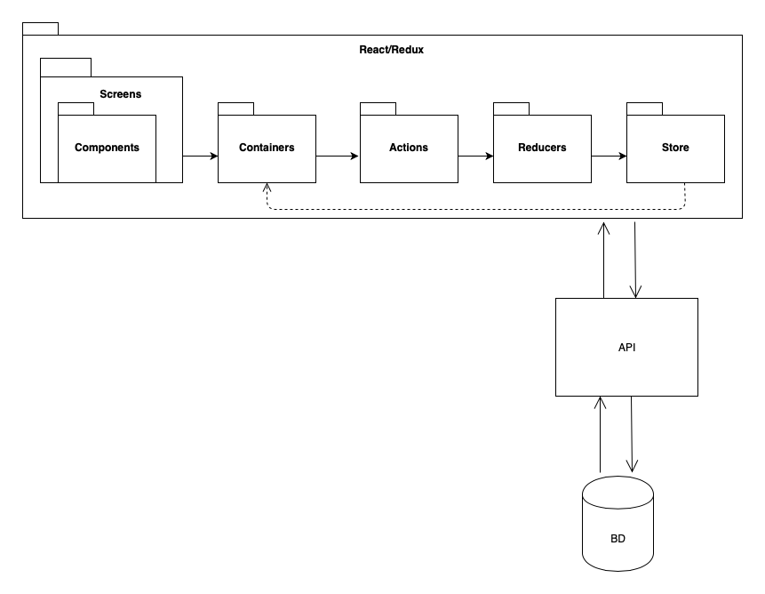
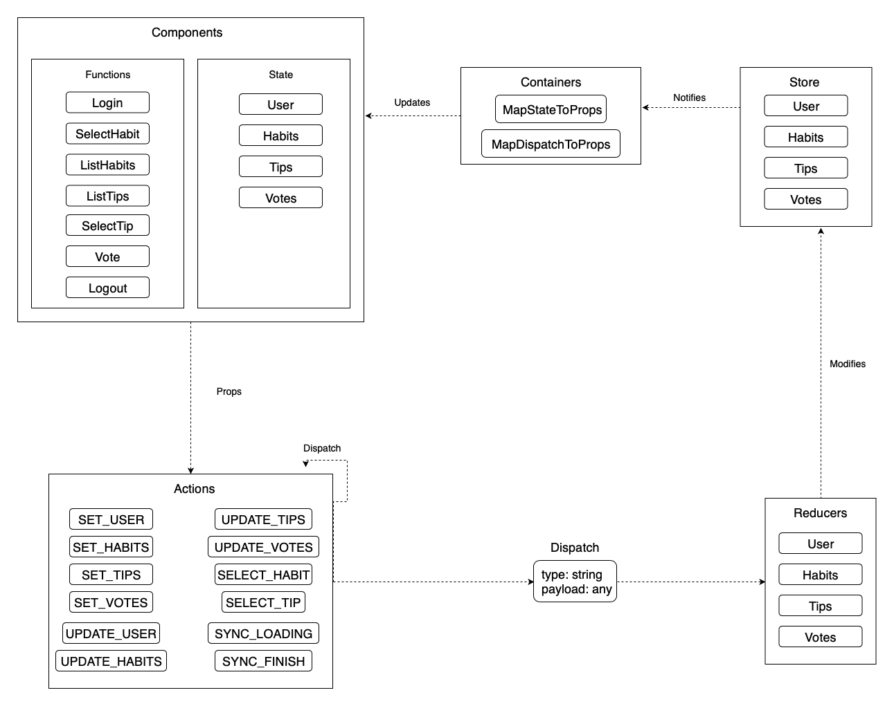

# Redux

## Pensando em Redux

* O Redux é um framework JavaScript
  * Funciona como um container de estados.
  * O Redux é basicamente divido em 3 partes: store, reducers e actions.
  * Segue 3 conceitos
    * Single Source of Truth (SSOT): Armazena todos os estados da aplicação em uma única fonte de informação.
    * State is Read-Only: Só é possível alterar um estado e emitindo uma action que contenha um objeto descrevendo o que ocorreu.
    * Changes are Made With Pure Funcions: As mudanças são feitas nos reducers, mostram como o estado atual levará ao estado seguinte.

### A store

"store" é o nome dado pelo Facebook para o conjunto de estados da sua aplicação. Vamos pensar na store como um grande centro de informações, que possui disponibilidade para receber e entregar exatamente o que o seu componente requisita (seja uma função, ou uma informação propriamente dita). Tecnicamente, a store é um objeto JavaScript que possui todos os estados dos seus componentes.

### Os reducers

Cada dado da store deve ter o seu próprio reducer, por exemplo: o dado "user" teria o seu reducer, chamado "userReducer". Um reducer é encarregado de lidar com todas as ações, como algum componente pedindo para alterar algum dado da store.

### As actions

Actions são responsáveis por requisitar algo para um reducer. Elas devem ser sempre funções puras, o que, dizendo de uma forma leiga, quer dizer que elas devem APENAS enviar os dados ao reducer, nada além disso.

## Problemas na arquitetura do Redux

<b>Não há encapsulamento</b>, caso queira adicionar uma nova variável irá adicionar esse valor a store global e ele estará disponível para ser acessado por todos os containers, inclusive os que não precisam ou não deveriam saber esse valor.

<b>O ciclo de vida da store é diferente do ciclo de vida dos componentes.</b> Se por exemlo, tivermos um carrinho de compras, e uma variável que indica que o carrinho de compras está cheio, nós deveremos manualmente limpar a variável de carrinho cheio sempre que for concluída uma compra, a necessidade de limpeza manual causa vários problemas.

<b>A store é um singleton</b>, mas um componente pode ter várias instancias, no exemplo do carrinho de compras o que acontece se estivermos mostrando dois carrinhos de compra simultaneamente? Só temos uma variável de carrinho cheio na store, deveremos criar outra ou um array delas, mas só queremos criar outro carrinho de compras e tudo se tornou feio, por que? Pois as variáveis da store não são encapsuladas e portanto não são totalmente reutilizaveis. A store global é um singleton enquanto um carrinho de compras pode ter várias instâncias. Essa é uma das razões pelas quais os singletons são na maioria das vezes considerados anti-padrões e devem ser evitados sempre que possível.

## Pacotes de Design Significativos do Ponto de Vista da Arquitetura

## Diagrama do Redux

# Referências bibliográficas

* [Entenda React e Redux](https://medium.com/@hliojnior_34681/entenda-react-e-redux-de-uma-vez-por-todas-c761bc3194ca). Hélio Kröger. 2017.
* [Arquitetura Merenda+](https://github.com/fga-eps-mds/2017.2-MerendaMais/wiki/Documento-de-Arquitetura). Merenda+. 2017.
* [The Ugly Side Of Redux](https://codeburst.io/the-ugly-side-of-redux-6591fde68200). Nir Yosef. 2017.
* [Como Redux funciona](https://medium.com/rafaelantoniolucio/como-redux-funciona-251f9c9e2d22). Rafael Antonio Lucio. 2017.
