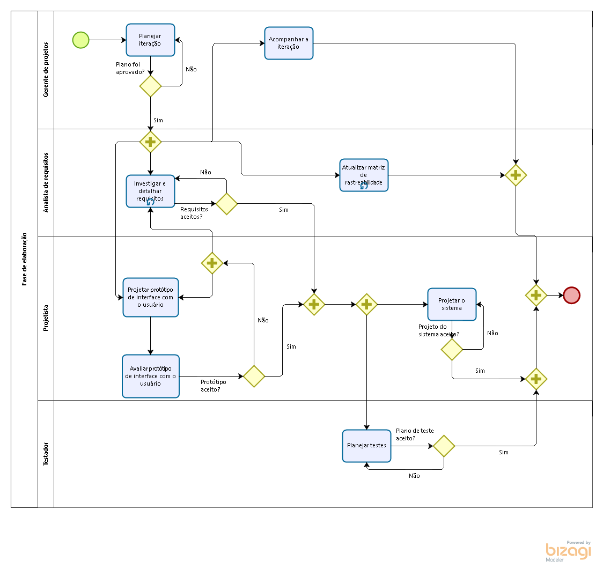
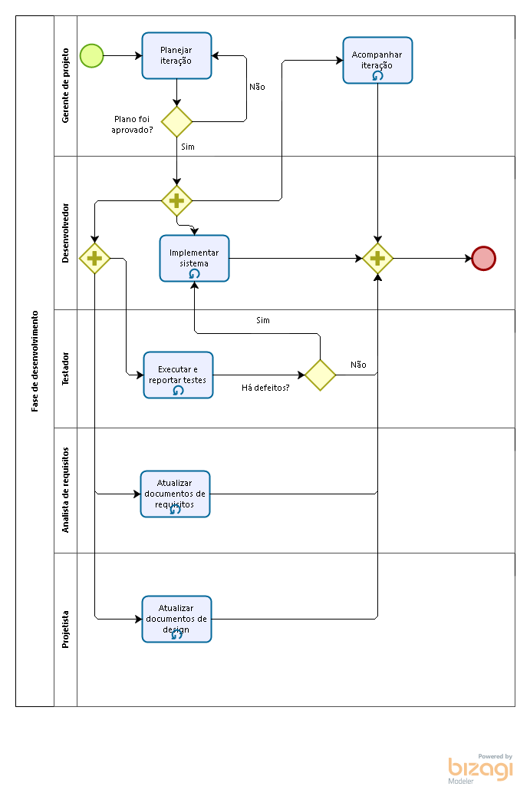
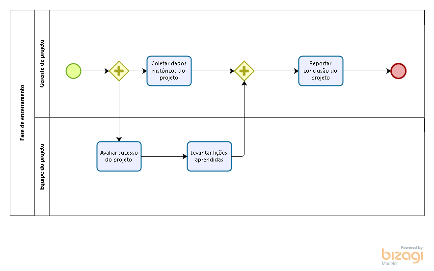

# Bizagi

| **Data**   | **Versão** | **Descrição**               | **Autor(es)**                 |
| ---------- | ---------- | --------------------------- | ----------------------------- |
| 04/04/2019 | 0.1        | Adição de diagramas         | Augusto Vilarins              |
| 08/05/2019 | 0.1        | Removendo tópicos em branco | Ícaro Oliveira e Gustavo Braz |

## Sumário

- [Bizagi](#bizagi)
  - [Sumário](#sum%C3%A1rio)
  - [1. Diagramas](#1-diagramas)
    - [1.1 Fase de Concepção](#11-fase-de-concep%C3%A7%C3%A3o)
    - [1.1 Fase de Elaboração](#11-fase-de-elabora%C3%A7%C3%A3o)
    - [1.2 Fase de Desenvolvimento](#12-fase-de-desenvolvimento)
    - [1.3 Fase de Encerramento](#13-fase-de-encerramento)

## 1. Diagramas

### 1.1 Fase de Concepção

### 1.1 Fase de Elaboração

### 1.2 Fase de Desenvolvimento

### 1.3 Fase de Encerramento

