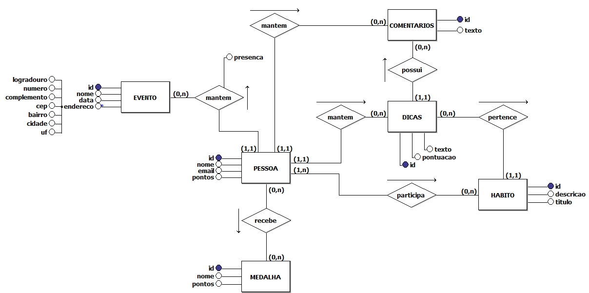
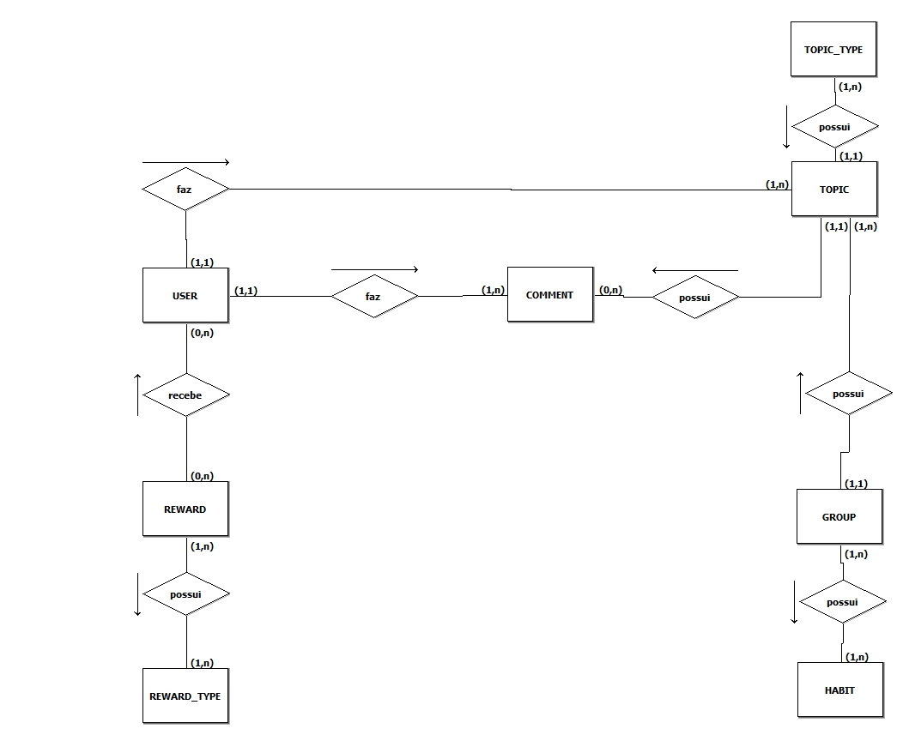
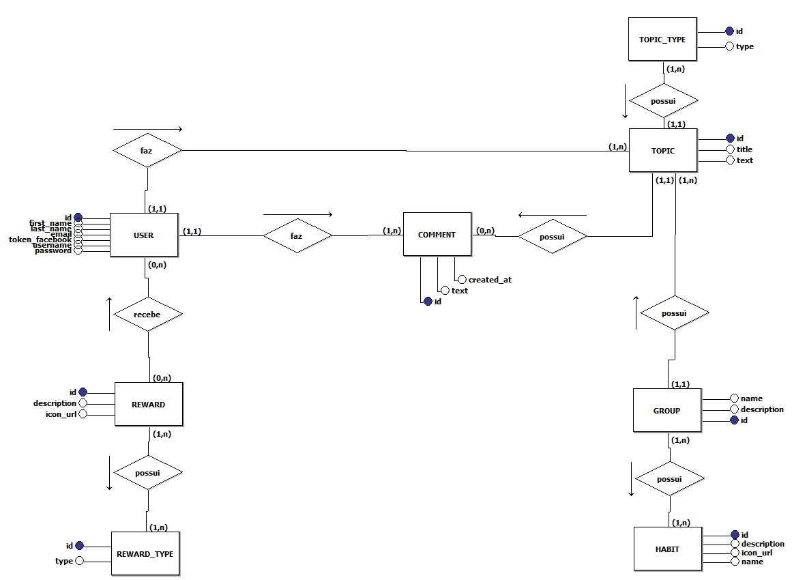
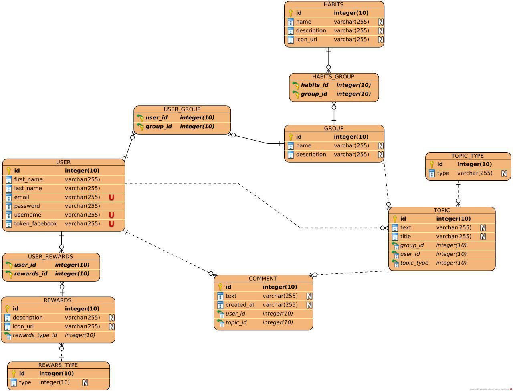
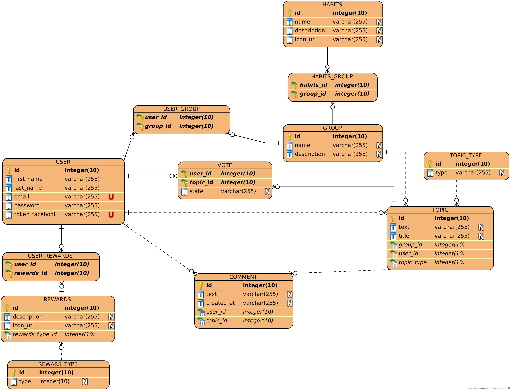

# DER

| **Data**   | **Versão** | **Descrição**                 | **Autor(es)**                                                                                                      |
| ---------- | ---------- | ----------------------------- | ------------------------------------------------------------------------------------------------------------------ |
| 11/04/2019 | 0.1        | Adição de DE-R                | Ana Carolina, Augusto Vilarins, Djorkaeff Alexandre, Guilherme Siqueira, Gustavo Braz, Rodrigo Dadamos, Vitor Leal |
| 12/04/2019 | 0.2        | Adição de Introdução          | Rodrigo Dadamos                                                                                                    |
| 08/05/2019 | 0.3        | Versionamento Diagrama Logico | Icaro Oliveira, Guilherme Siqueira, Gustavo Braz                                                                   |

## Sumário

- [DER](#der)
  - [Sumário](#sum%C3%A1rio)
  - [1. Introdução](#1-introdu%C3%A7%C3%A3o)
  - [2. DER](#2-der)
    - [DER versão 1](#der-vers%C3%A3o-1)
    - [DER versão 2](#der-vers%C3%A3o-2)
    - [DER versão 3](#der-vers%C3%A3o-3)
  - [3. Diagrama Lógico](#3-diagrama-l%C3%B3gico)
    - [Lógico versão 1](#l%C3%B3gico-vers%C3%A3o-1)
    - [Lógico versão 2](#l%C3%B3gico-vers%C3%A3o-2)

## 1. Introdução

Diagrama Entidade Relacionamento (DER) é a representação gráfica do modelo conceitual.

## 2. DER

### DER versão 1

### DER versão 2

### DER versão 3

## 3. Diagrama Lógico

### Lógico versão 1

### Lógico versão 2

