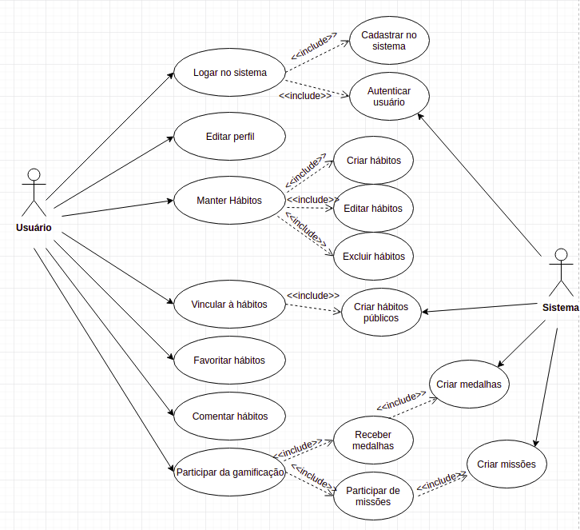
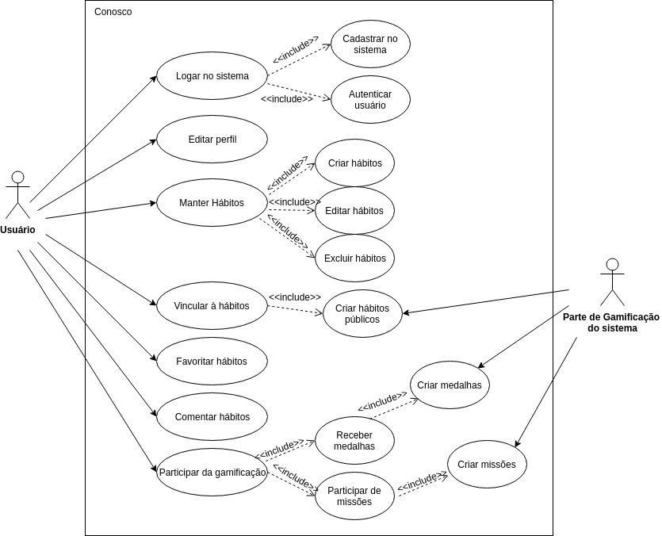

# Diagramas UML

| **Data**   | **Versão** | **Descrição**               | **Autor(es)**  |
| ---------- | ---------- | --------------------------- | -------------- |
| 10/04/2019 | 0.1        | Adição v1                   | Gustavo Braz   |
| 16/04/2019 | 0.2        | Adição v2                   | Gustavo Braz   |
| 08/05/2019 | 0.2        | Adição historico de revisão | Icaro Oliveira |

Segue abaixo a diagramação feita pela equipe no intuito de modelar e elucidar as caracteristicas específicas do sistema. Foi utilizado a notação de modelo conceitual UML para gerar os modelos abaixo. A ferramenta utilizada para a confecção desse modelo foi o draw.io (Google)

## Diagrama de Casos de uso v 0.1

Segue abaixo o diagrama de casos de uso feito pela equipe. O diagrama pode ser visualizado em tamanho maior neste [Link](https://drive.google.com/file/d/18weBSNd3cMcLPhbnaUOwqXxOYLgIQswB/view?usp=sharing)

## Diagrama de Casos de uso v 0.2

Segue abaixo o diagrama de casos de uso feito pela equipe. O diagrama pode ser visualizado em tamanho maior neste [Link](https://drive.google.com/file/d/18weBSNd3cMcLPhbnaUOwqXxOYLgIQswB/view?usp=sharing)

