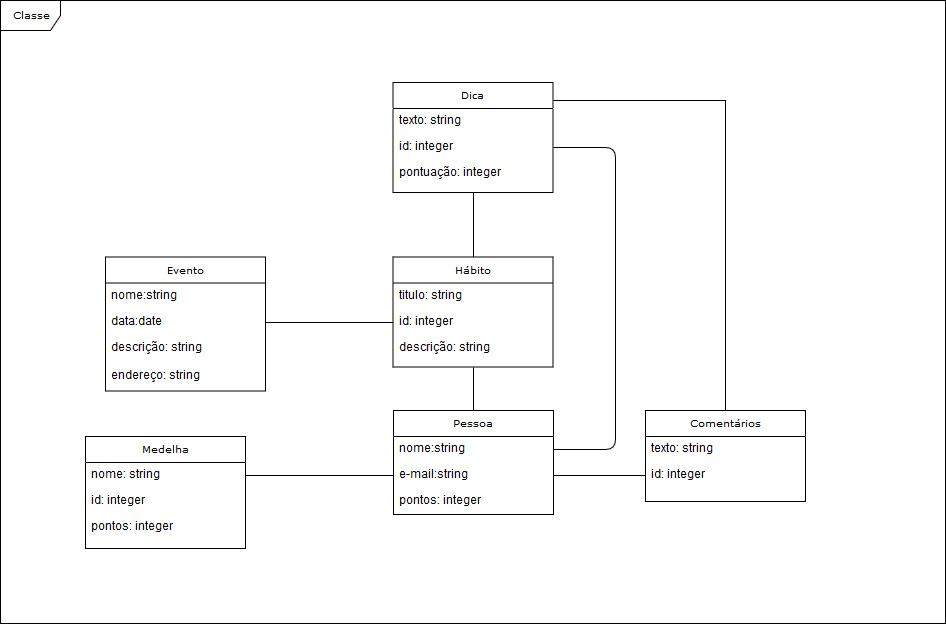

# Diagramas UML

Segue abaixo a diagramação feita pela equipe no intuito de modelar e elucidar as caracteristicas específicas do sistema. Foi utilizado a notação de modelo conceitual UML para gerar os modelos abaixo. A ferramenta utilizada para a confecção desse modelo foi o Draw.io(Google)

## Diagrama de classe

Segue abaixo o diagrama de classe feito pela equipe. O diagrama pode ser vizualizado em tamanho maior nesste [Link](www.google.com)

