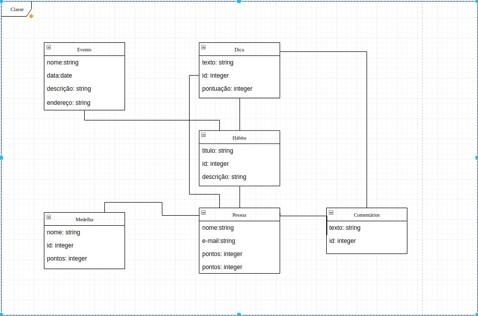
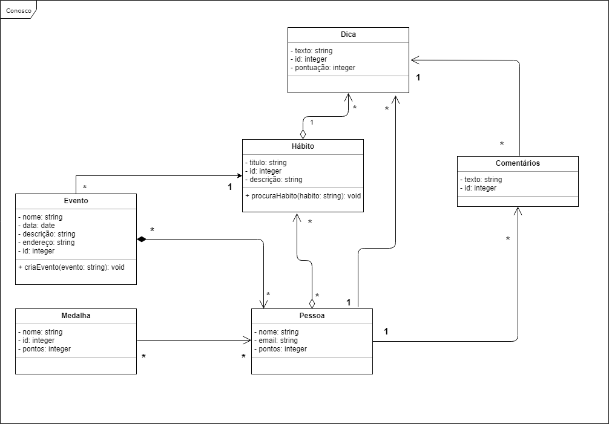
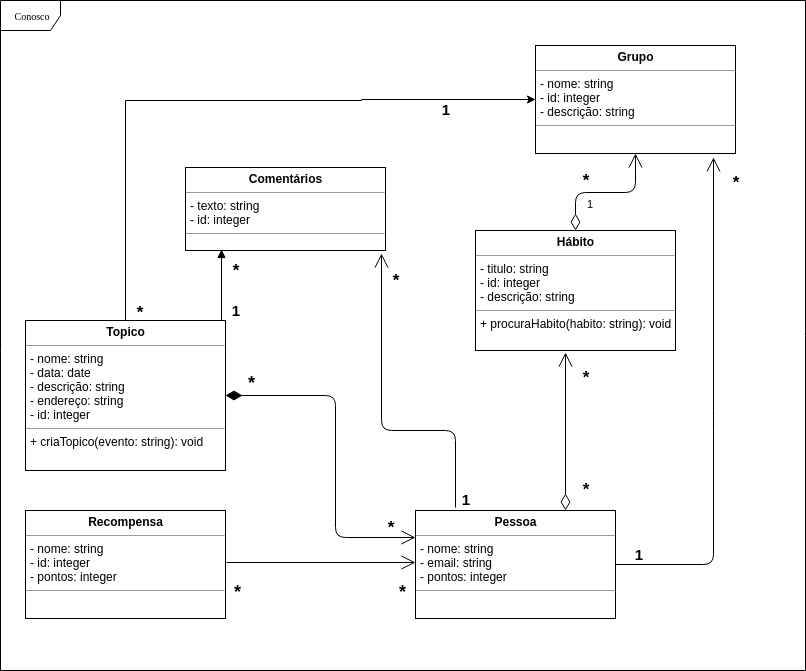

# Diagramas UML

| **Data**   | **Versão** | **Descrição**               | **Autor(es)**  |
| ---------- | ---------- | --------------------------- | -------------- |
| 20/04/2019 | 0.1        | Adição v1 e v2              | Todos          |
| 08/05/2019 | 0.1        | Adição historico de revisão | Icaro Oliveira |

# Diagramas UML

Segue abaixo a diagramação feita pela equipe no intuito de modelar e elucidar as caracteristicas específicas do sistema. Foi utilizado a notação de modelo conceitual UML para gerar os modelos abaixo. A ferramenta utilizada para a confecção desse modelo foi o Draw.io(Google)

## Diagrama de classe

Segue abaixo o diagrama de classe feito pela equipe. O diagrama pode ser vizualizado em tamanho maior neste [Link](https://www.draw.io/#G10nOgtsqtQeo5Sjdg5-TZ56h57giAfR8c)

## Diagrama de classe versão 0.1

## Diagrama de classe versão 0.2

## Diagrama de classe versão 0.3

