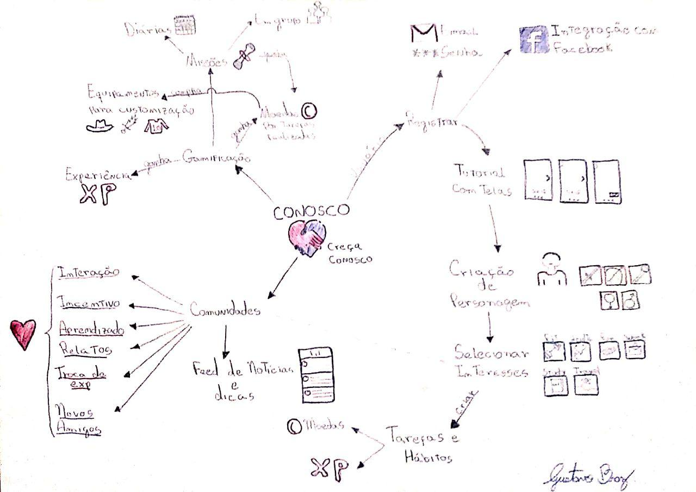
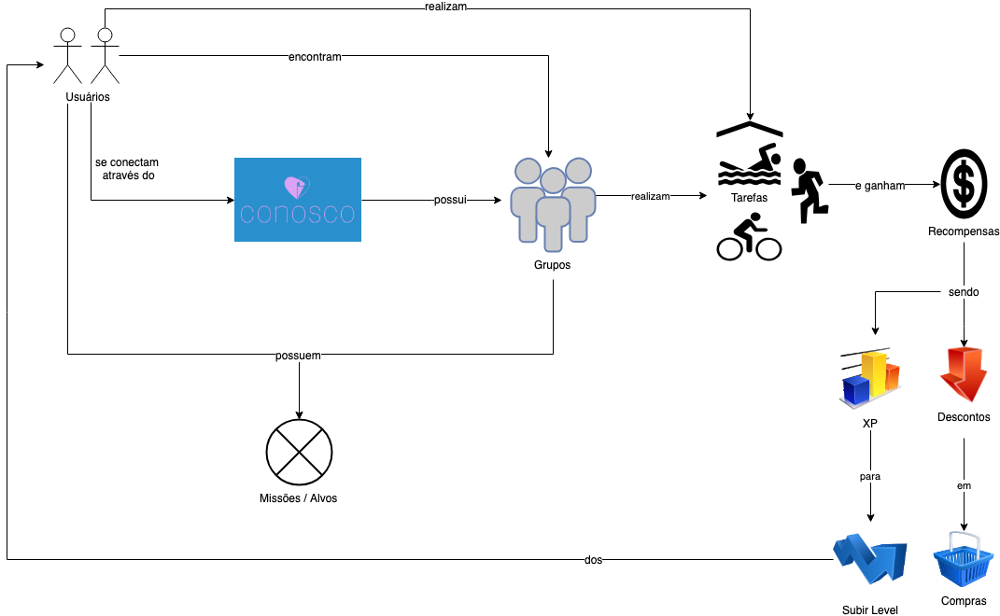
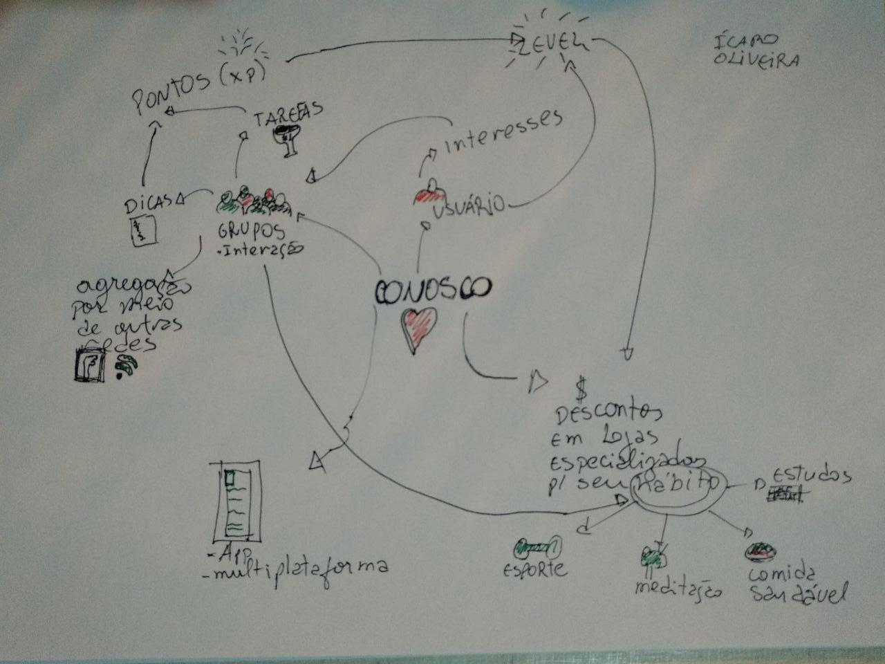

# Rich Picture
| **Data** | **Versão** | **Descrição** | **Autor(es)** |
|---|---|---|---|
|05/04/2019 | 0.1 | Adição de Rich Pictures | Guilherme Siqueira, Gustavo Braz, Ícaro Oliveira |

## Sumário
- [1. Introdução](#introducao)
  - [Sumário](#sum%C3%A1rio)
  - [2. Rich Picture](#2-rich-picture)
    - [2.1 Rich Picture 1](#21-rich-picture-1)
    - [2.2 Rich Picture 2](#22-rich-picture-2)
    - [2.3 Rich Picture 3](#23-rich-picture-3)
  - [3. Referências Bibliográficas](#3-referencia-bibliografica)

## 1. Introdução
> "**Rich Picture** trata-se de uma modelagem cuja notação permite analisar problemas e expressar ideias. É um modelo informal, bem fácil de entender, e que pode ser construído colaborativamente com o cliente. Pode também auxiliar na identificação de processos de negócio e seus requisitos."

## 2. Rich Pictures
### 2.1 Rich Picture 1

### 2.2 Rich Picture 2

### 2.3 Rich Picture 3

### 3 Referência Bibliográfica
