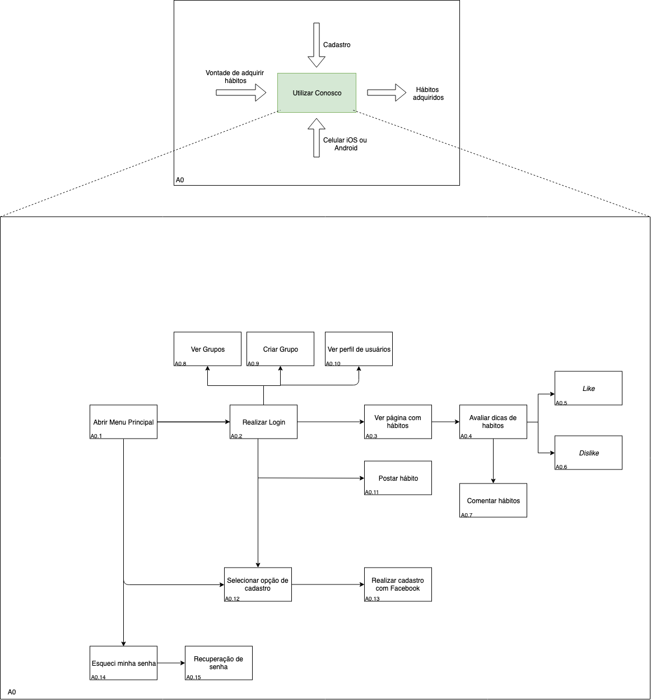

# Structured Analysis and Design Technique - SADT
| **Data** | **Versão** | **Descrição** | **Autor(es)** |
|---|---|---|---|
|04/04/2019 | 0.1 | Adição de Introdução e SADT | Guilherme Siqueira |

## Sumário
- [1. Introdução](#introducao)
  - [Sumário](#sum%C3%A1rio)
  - [2. Diagrama](#1-diagrama)
  - [3. Referências Bibliográficas](#2-referencia-bibliografica)

## 1. Introdução

## 2. Diagrama

### 3 Referência Bibliográfica
- LI, Yuling. SADT - Structured Analysis and Design Technique. Delft - Países Baixos, 2016. Slide. Disponível em: https://tudelft.openresearch.net/image/2016/12/6/wm0821tu_ri_sadt_ws.pdf.